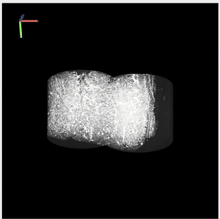
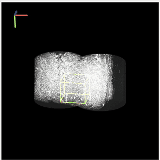
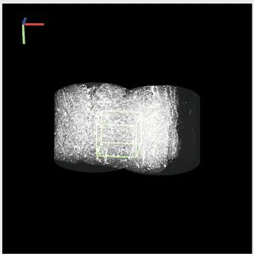
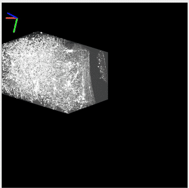
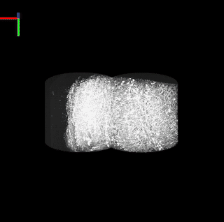
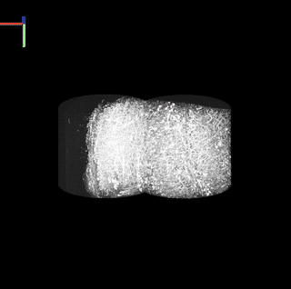

# LV-VIS (Large-Volume, Multi‑Resolution Viewer)

An interactive **multi‑volume, multi‑resolution (LOD)** viewer built on **VisPy + PyQt5**. It renders large 3D volumes with octree-style drill‑down, side‑by‑side **Interactive** and **Global** canvases, ROI picking, per‑volume translation, and a rich control panel with **GPU/RAM monitors**, **camera tools**, and **screenshot utilities**.

---

## 1) Requirements

Follow the [main README installation section](../README.md#installation) for environment setup instructions.
This ensures consistent package versions and avoids duplication of installation steps.

---

## 2) Input Formats

### A. Viewer CSV (4 columns)

No header, four columns per row: `path,x,y,z`. The coordinates `(x,y,z)` are the **world‑space origin** (in original‑resolution voxels) where this volume should be placed.

```csv
# viewer.csv (no header)
/data/rod1/part3_1, 0, 0, 0
/data/rod2/part7_3, 1200, 0, 800
```

### B. Single folder (GUI only)

You can launch the GUI in **Single Volume** mode and select one folder. The launcher will generate a temporary 4‑column CSV with `(0,0,0)` as the placement.

---

## 3) Quick Start

### Option 1: GUI Launcher (`lv_vis_gui.py`)

```bash
python lv_vis_gui.py
```

**Steps**

1. Choose **Single Volume** or **Multi‑Volume**.
2. For **Multi‑Volume**:

   * **From CSV**: Browse to a 4‑column viewer CSV (see above), then **Launch**.
   * **From Multiple Folders + Manual Coordinates**: Add rows with folder path + `(x,y,z)` → **Launch** (the launcher writes a temp CSV behind the scenes).

### Option 2: CLI (direct viewer)

```bash
python lv_vis.py path/to/viewer.csv
```

* If `viewer.csv` is omitted, the default example path inside the script is used.
* The CSV must have 4 columns as described above.

---

## 4) Viewer Window Layout

When the viewer opens (from `lv_vis.py`):

* **Left column**: *Interactive Canvas*
* **Right column**: *Global Canvas*
* **Bottom**: *Control Panel*

**Interactive Canvas**

* Main view for ROI picking, drilling (zoom‑in), moving individual volumes, etc.

**Global Canvas**

* Overview of the scene, useful to maintain context. Shows a global ROI box when you zoom‑in.

**Control Panel**

* GPU and RAM usage monitors (real‑time line charts)
* Camera control tools (apply azimuth/elevation/roll, recenter camera)
* Screenshot tool (Interactive canvas, auto‑crop borders)

---

## 5) Mouse & Keyboard Cheat‑Sheet

### A. Selection & Zoom-in (ROI)

* **Hold `Ctrl` + Left‑Click** on the **Interactive** canvas to pick a volume at the cursor.

<p align="center">
      
</p>

* A translucent ROI box is drawn around the picked region.
* **W/A/S/D/Q/E** (while `Ctrl` is held) → Move the ROI box by ±1 voxel along X/Y/Z (X: A/D, Y: W/S, Z: Q/E).
<p align="center">
      
</p>

* **`Y`** → Zoom-in (load the next LOD level) at the current ROI for all overlapping volumes.
<p align="center">
      
</p>

  * The **Global** canvas will display a yellow‑edged ROI box for context.
* **`N`** → Cancel / remove the ROI box.

### B. Zoom-out

* **`Alt`** (when current layer > 0) → Step **back up** one LOD level.

<p align="center">
      
</p>

### C. Volume Translation (manual fine alignment)

* **`O` / `P`** → Select previous/next volume (the selected one briefly dims to indicate selection).

<p align="center">
      
</p>

* **`W/A/S/D/Q/E`** (without holding `Ctrl`) → Move the **selected volume** by `move_step` (default 2.0) along X/Y/Z.

<p align="center">
      
</p>

* The translation is applied in world/LOD space with correct scale factors; both canvases update accordingly.

### D. Camera & Animation

* **`R`** → Toggle auto‑rotation.
* Camera numeric controls are available in the **Control Panel** (see next section).

> Note: Key names are case‑insensitive in practice, but the UI hints show uppercase for clarity.

---

## 6) Control Panel (bottom bar)

### A. GPU & RAM Monitors

* **GPU (cyan):** NVIDIA GPU process memory in MB (via NVML, if available).
* **RAM (white):** Python process memory usage in MB (via `psutil`).
* Updated once per second with \~60 s history.
* Labels above the charts show the latest usage values.

### B. Camera Control

* **Canvas selector:** Choose which camera to control (*Interactive* or *Global*).
* **Axis selector:** Rotation axis (`azimuth`, `elevation`, or `roll`).
* **Angle input + Apply:** Enter a numeric angle (float) and apply to the selected camera.
* **Center Camera:** Reset and recenter on all loaded volumes.
* **Screenshot:** Capture the Interactive canvas to a `.tiff` file.

  * Temporarily hides the axis overlay, crops black borders, then restores it.

### C. Volume Panel

* **Select Volume:** Drop-down menu of loaded volumes (by ID).
* **Translation readout:** Shows current translation for the selected volume in both
  *Interactive* and *Global* canvases.
* **Rendering parameters:** Adjust

  * `gamma` (0.05–5.0),
  * `u_min` (0.0–1.0),
  * `u_max` (0.0–1.0).
* **Reset button:** Restore render parameters to defaults (`gamma=1.0, u_min=0.0, u_max=1.0`).

### D. Memory Logging

* **Status indicator:** Shows **idle** (gray) or **REC** (red).
* **Start Logging / Stop & Save:** Toggle recording of RAM/VRAM usage over time.
* On stop, prompts to save results as a CSV (`time_iso, elapsed_s, ram_mb, vram_mb`).


---

## 7) ROI ↔ World Coordinates (What Happens on Zoom-in)

1. You pick an ROI in the **Interactive** canvas at the current LOD level `L`.
2. The ROI bounds are converted to **original‑resolution global voxels** using the per‑level scale factor `factor[L]`.
3. For each volume, the viewer checks overlap between the ROI and that volume’s **global extent**.
4. If overlapping, the midpoint is converted back to the volume’s **local layer‑L coordinates** and passed to `extract_next(...)` to fetch the sub‑volume at level `L+1`.
5. All overlapping volumes are rendered at `L+1`. The controller’s `current_layer` increments.
6. A global context box is drawn in the **Global** canvas.

Use **`Alt`** to step back to the previous level.

---

## 8) Data Expectations & Tips

* Each volume **folder name** should match its **root `.npy`** file, e.g. `.../Data/Data.npy` (loaded for Level‑0).
* The multi‑level factors are inferred from the on‑disk LOD structure; ensure your preprocessing produced the correct folder tree and arrays.
* If memory is tight, avoid drilling too deep on many volumes at once; use the **Global** canvas to keep track.
* For precise alignment, start with larger steps (default `move_step=2.0`), verify in **Global**, then refine.

---

## 9) Troubleshooting

* **Nothing happens when pressing `Y`**: Make sure you have an ROI box (Ctrl+Click first) and that it overlaps at least one volume at the current layer.
* **`Alt` doesn’t go up**: You can only step up if `current_layer > 0`.
* **Volume didn’t move**: Check that you selected the intended volume (`O`/`P`) and that you’re **not** holding `Ctrl` (which moves the ROI instead).
* **GPU chart shows 0 MB**: Ensure NVML is available and the GPU supports per‑process accounting; otherwise GPU memory may not be reported.
* **Screenshot saved but fully black**: Verify that there’s content in the Interactive canvas and that the axis overlay is restored.

---

## 10) CLI Examples (Direct Viewer)

```bash
# Launch with a prepared 4‑column viewer CSV
python lv_vis.py ./datapath_csv/my_volumes.csv

# Launch the GUI (preferred for casual users)
python lv_vis_gui.py
```

---

## 11) Developer Notes (structure & key classes)

* **`lv_vis.py`** – Main viewer window. Wires canvases, cameras, keyboard/mouse handlers, and Control Panel.
* **`vol_setting.py`** – `SingleVolumeLOD` (per‑volume I/O, rendering, `extract_next` drill), `MultiVolumeController` (manages volumes, current layer).
* **`CanvasSetting.py`** – `CanvasManager`, `CameraController` (Turntable camera), `AxisVisualizer` synced with camera.
* **`selectBox.py`** – ROI picking, global box rendering, move ROI, level overlays.
* **`controlPanel.py`** – GPU/RAM usage monitors, camera controls, screenshot & center actions.
* **`my_volume.py` / `my_volume_pos.py`** – Custom VisPy visuals for rendering and picking.

---

## 12) Demo video

* **Single Volume** (Demo with CT-reconstructed mouse hippocampus volume)- [https://youtu.be/hVT-jfipEO0](https://youtu.be/hVT-jfipEO0)
* **Multiple Volume** (Demo with CT-reconstructed mouse hippocampus volume)- [https://youtu.be/c9whmH5vtbs](https://youtu.be/c9whmH5vtbs)
